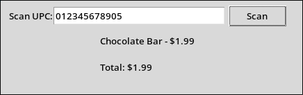

[](https://classroom.github.com/a/-cPJVYMd)
Django ORM Standalone
=====================


**This is part 1 of assignment 3 for SOFE3650 group 35 CRN 45894**

:gear: Requirements
-------------------
- Last tested successfully with Python 3.10.4 and Django 5.0.6
- Create venv and pip install django to import the required modules.

:open_file_folder: File Structure
---------------------------------
This project contains the following structure:
```
django-orm/
├── .github/
│   └── (GitHub Classroom feedback)
│
├── db/
│   ├── migrations/
│   │   ├── 0001_initial.py
│   │   ├── 0002_rename_product_name_products_name.py
│   │   └── __init__.py
│   ├── models.py
│   └── __init__.py
│
├── main.py
├── manage.py
├── products.csv
├── db.sqlite3
├── settings.py
└── README.md
```
:rocket: Quick Setup
--------------------
Create a folder for your project on your local machine
```
mkdir myproject; cd myproject
```
Create a virtual environment and install django
```
python -m venv venv; source venv/bin/activate; pip install django
```
install tkinter for your system
```
ex arch linux: sudo pacman -Sy tk
ex ubuntu: sudo apt install python3-tk
```
Download this project template from GitHub
```
git clone git@github.com:OTUSOFE365025/assignment-3-django-and-energy-group-35-crn-45894.git; cd assignment-3-django-and-energy-group-35-crn-45894
```
Initialize the database
```
python manage.py makemigrations db; python manage.py migrate
```
Run the project
```
python main.py
```

:crystal_ball: Example
----------------------
After running Quick Start above: 

Output from command: ```python main.py```


:mortar_board: Django Models
----------------------------

Link: [How to Use Django Models](https://docs.djangoproject.com/en/3.1/topics/db/models/)

License
-------

The MIT License (MIT) Copyright (c) 2024 Dan Caron

Permission is hereby granted, free of charge, to any person obtaining a copy of this software and associated documentation files (the "Software"), to deal in the Software without restriction, including without limitation the rights to use, copy, modify, merge, publish, distribute, sublicense, and/or sell copies of the Software, and to permit persons to whom the Software is furnished to do so, subject to the following conditions:

The above copyright notice and this permission notice shall be included in all copies or substantial portions of the Software.

THE SOFTWARE IS PROVIDED "AS IS", WITHOUT WARRANTY OF ANY KIND, EXPRESS OR IMPLIED, INCLUDING BUT NOT LIMITED TO THE WARRANTIES OF MERCHANTABILITY, FITNESS FOR A PARTICULAR PURPOSE AND NONINFRINGEMENT. IN NO EVENT SHALL THE AUTHORS OR COPYRIGHT HOLDERS BE LIABLE FOR ANY CLAIM, DAMAGES OR OTHER LIABILITY, WHETHER IN AN ACTION OF CONTRACT, TORT OR OTHERWISE, ARISING FROM, OUT OF OR IN CONNECTION WITH THE SOFTWARE OR THE USE OR OTHER DEALINGS IN THE SOFTWARE.
